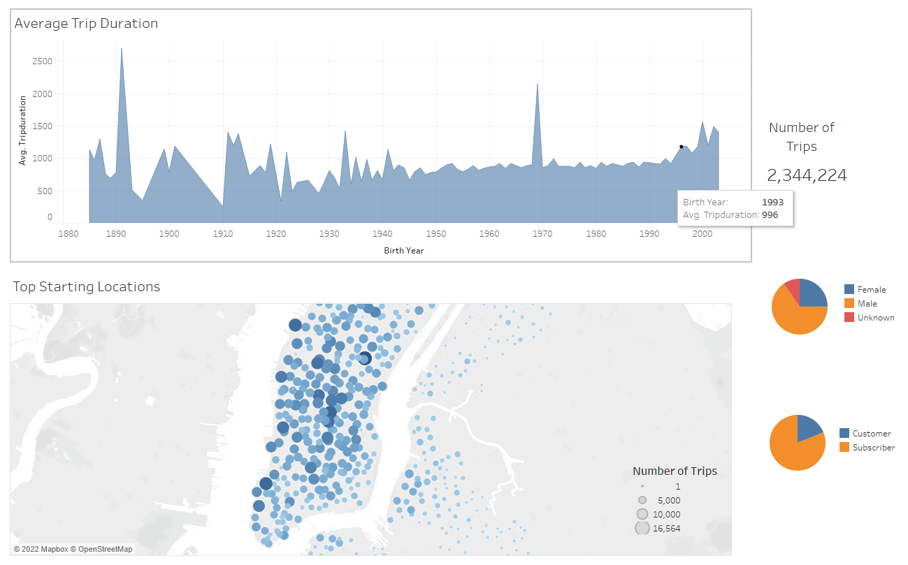
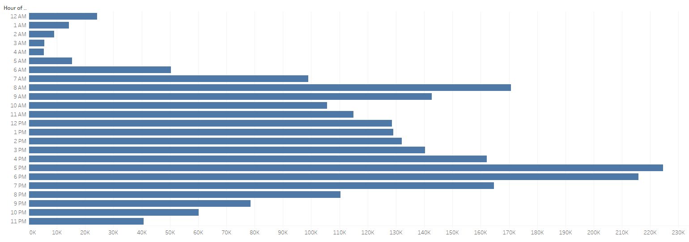
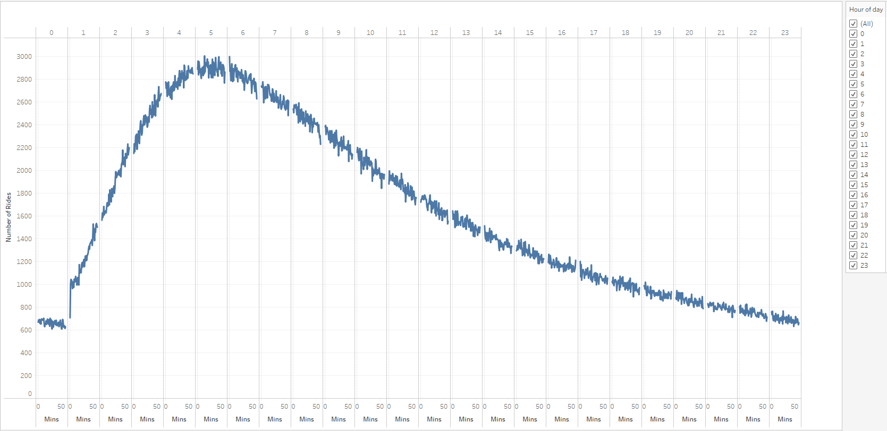
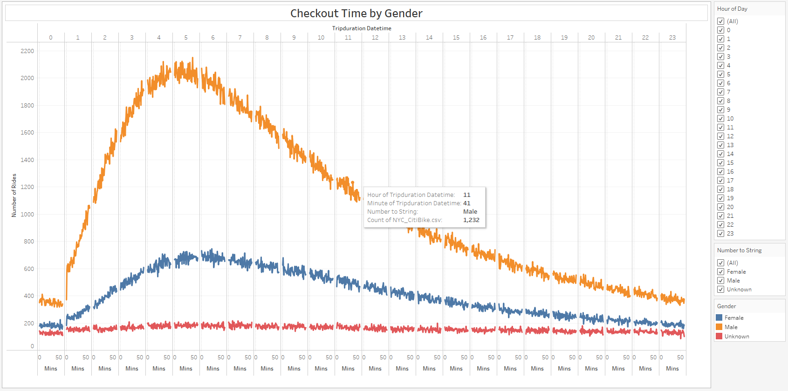
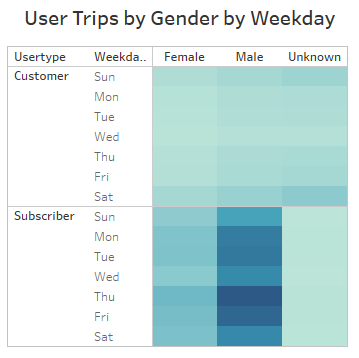
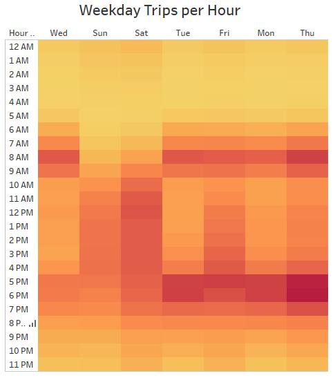
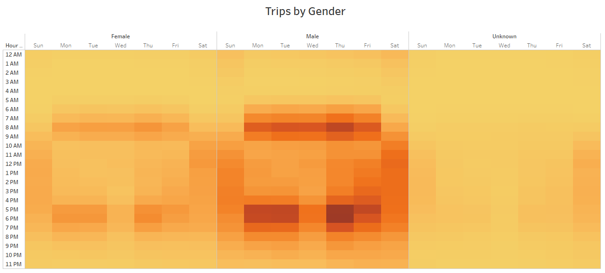

# Bikesharing
This project is an analysis of New York Citi-Bike System data, using data visualization tools to explore the viability of a bike-sharing business in Des Moines.

## Purpose
Using [Tableau](https://public.tableau.com/en-us/s/) and create a set of visualizations that :
- Show the length of time that bikes are checked out for all riders and genders.
- Show the number of bike trips for all riders and genders for each hour of each day of the week.
- Show the number of bike trips for each type of user and gender for each day of the week.

### Resources
- Data Resourec:&nbsp;  [201908-citibike-tripdata.csv.zip](https://s3.amazonaws.com/tripdata/201908-citibike-tripdata.csv.zip) &nbsp; at &nbsp; [Citi Bike Website](https://ride.citibikenyc.com/system-data)
 

## Results
<h3 align="center" style="font-size: 25px">
  <a href="https://public.tableau.com/app/profile/laleh1808/viz/NYC_CitiBike_16594003839910/NYCCitiBikeRidesharingAnalysis?publish=yes"> Link to Tableau Dashboard </a>
</h3>

 

## NYC Citi Bike System data visualization for August 2019

### Average Trip Duration

- There were over 2.3 million rides for the month of August 2019.
- 81% of the users were subscribers. 65% of the users were confirmed males and 25% were confirmed females.
- There is a wide range of the age of the users. Younger users tend to use the service for longer rides.
- Top ride starting locations are in the most touristic and busy areas, as we see here in Manhattan.

### August Peak Hours

- Highest activity hours are from 7-8 am and 5-7 pm and require the most resources mobilized.
- The activity from 2:00 AM to 5:00 AM is low so this would be the window for bike maintenance.

### Checkout times by Users

- Most weekday rides are around 7:00 AM to 9 AM and 5:00 PM to 7:00 PM.
- Weekend rides are highest from 10:00 AM to 7:00 PM.
- Those rides are mostly taken by male users.
- Bikes are mostly checked out for 4 to 6 hours.

### Checkout times by Gender

- Male users take approximately 3 times more rides than the female users.

 

### Bike Trips by Weekday by Gender

 &nbsp; &nbsp; &nbsp; &nbsp;  
 

- Most weekday rides are around 7:00 AM to 9 AM and 5:00 PM to 7:00 PM.
- Weekend rides are highest from 10:00 AM to 7:00 PM.
- Those rides are mostly taken by male users.

## Summary
The data shows high activity of the bike sharing service in New York during the month of August 2019.
The far majority of the rides were in the very busy Manhattan Island, taken by male users during morning and evening rush hours. This implies that Citi Bike services are used as an alternative to public transportation by commuting workers. 
 
Additional analysis would be beneficial by :
- comparing data for different months to determine trends across the year,
- including weather data to find the correlation between the weather and the rides.

 
